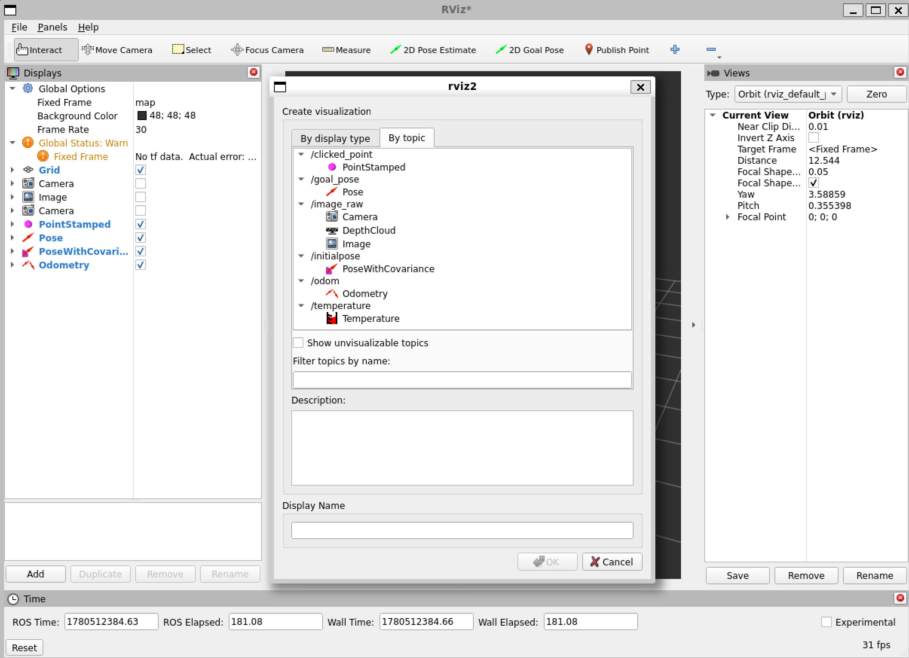

# Tello Drone Project — Development Diary

---

## Session 1 — 2026-05-18

### Goal
Start Phase 0: get WSL2 + ROS 2 Humble running on Windows 11 as the foundation for the Tello ROS stack.

### Context
- Hardware: DJI Tello drone (standard model, not EDU)
- Machine: Windows 11 notebook, WiFi only (no ethernet, no USB dongle)
- Connectivity plan: notebook WiFi switches to Tello AP when flying; phone USB tether for internet in the meantime
- CPU only for now; GPU expected ~2026-07

### Plan reference
Full project plan in `PLAN.md`. Phases ordered CPU-first:
- Phases 0–4: no GPU needed (setup, driver, odometry, mosaic, mission)
- Phases 5–6: depth estimation + collision avoidance (deferred until GPU)

---

### Steps Attempted

#### Step 1 — WSL2 config (`.wslconfig`)
- Opened `%USERPROFILE%\.wslconfig` via notepad
- Added `networkingMode=mirrored` under `[wsl2]`
- Ran `wsl --shutdown`

**Result:** ❌ Error — WSL2 is not installed at all.
```
The Windows Subsystem for Linux is not installed.
```

#### Step 2 — WSL2 Install
- Ran `wsl --install` as Administrator → downloaded WSL2 kernel 2.7.3
- Required **two reboots** to fully enable VirtualMachinePlatform feature
- After second reboot: `wsl --install -d Ubuntu-22.04` succeeded
- Ubuntu 22.04 launched, created user `riris`

**Result:** ✅ Ubuntu 22.04 running inside WSL2

#### Step 3 — Phase 0 Verification
- `.wslconfig` confirmed: `networkingMode=mirrored` ✅
- `echo $DISPLAY` returned `:0` → WSLg active ✅
- `sudo apt update && sudo apt upgrade -y` → clean, no errors ✅

#### Step 4 — ROS 2 Humble Install
- Added ROS 2 apt repo and GPG key ✅
- Installed `ros-humble-desktop`, `python3-colcon-common-extensions`, `python3-rosdep` ✅
- Ran `sudo rosdep init && rosdep update` ✅
- Added `source /opt/ros/humble/setup.bash` to `~/.bashrc` ✅

#### Step 5 — RViz2 Test
- `ros2 doctor` ran but hung on network discovery (DDS timeout) — cancelled with Ctrl+C, not an error
- `ros2 run rviz2 rviz2` launched successfully
- RViz window appeared on Windows desktop via WSLg ✅
- OpenGL 4.1, running at **31 fps** ✅
- Expected warnings: `No tf data` (no drone connected yet), `Global Status: Warn` (normal when idle)

**Result:** ✅ Phase 0 fully complete

---

### Notes & Observations
- `ros2 --version` flag doesn't exist in ROS 2 — use `ros2 run` or `ros2 topic list` to verify install
- `ros2 doctor` hangs for ~60s on network probe — skip it, not useful day-to-day
- WSL2 needed **2 reboots** during install (VirtualMachinePlatform enablement)
- Copy/paste in default Windows console: right-click to paste. Recommend installing **Windows Terminal** from MS Store for better experience

---

### Blockers
None — Phase 0 complete.

### Next — Phase 1
1. Create ROS 2 workspace (`~/tello_ws`)
2. Clone `tello_ros` and `ros2_shared`
3. Build with `colcon`
4. Connect to Tello AP and do first takeoff/land from ROS

---

## Session 2 — 2026-05-18 (continued)

### Goal
Phase 1: Build tello_ros workspace, first drone connection and takeoff via ROS.

### Steps

#### Step 1 — Workspace & driver clone
```bash
mkdir -p ~/tello_ws/src
git clone tello_ros + ros2_shared
```
**Result:** ✅ Both cloned successfully

#### Step 2 — rosdep + colcon build (attempt 1)
**Result:** ❌ `tello_description` failed — `replace.py` missing execute permission
**Fix:** `chmod +x .../replace.py`

#### Step 3 — colcon build (attempt 2)
**Result:** ❌ `tello_driver` failed — `asio.hpp` not found + `rclcpp_components/register_node_macro.hpp` not found
**Fix:** `sudo apt install -y libasio-dev` (rclcpp_components was already installed)

#### Step 4 — colcon build (attempt 3)
**Result:** ❌ `register_node_macro.hpp` still not found
**Diagnosis:** Header exists at `/opt/ros/humble/include/rclcpp_components/rclcpp_components/register_node_macro.hpp` but `rclcpp_components` was missing from `DRIVER_NODE_DEPS` and `JOY_NODE_DEPS` in `tello_driver/CMakeLists.txt` — so its include path was never passed to the compiler
**Fix:** Added `rclcpp_components` to both dep lists in CMakeLists.txt

#### Step 5 — colcon build (attempt 4)
**Result:** ✅ All 5 packages finished clean
```
Summary: 5 packages finished [26.5s]
tello_msgs / ros2_shared / tello_description / tello_driver / tello_gazebo
```

#### Step 6 — Source workspace
```bash
source ~/tello_ws/install/setup.bash
echo "source ~/tello_ws/install/setup.bash" >> ~/.bashrc
```
**Result:** ✅ Workspace sourced and added to .bashrc permanently

### Notes
- `tello_ros` CMakeLists.txt has a bug: `rclcpp_components` is found via `find_package` but not added to target deps — causes build failure on ROS 2 Humble due to new include path layout
- Fix is permanent in the cloned source; will survive rebuilds

### Next
- Power on Tello, connect Windows WiFi to Tello AP (`TELLO-XXXXXX`)
- Verify `ping 192.168.10.1` from WSL
- Launch `tello_driver` and verify topics
- First takeoff/land via ROS service call

---

## Session 3 — 2026-05-18 (continued)

### Goal
Fix ROS 2 inter-process communication — two WSL2 terminals on the same machine cannot exchange topics.

### Symptom
- Terminal 1: `ros2 topic pub` publishes fine, no errors
- Terminal 2: `ros2 topic echo` hangs indefinitely, prints nothing
- This is a fundamental DDS communication failure, not a Tello issue

### What We Tried

| Attempt | Config | Result |
|---------|--------|--------|
| Default FastDDS | nothing | `ros2 topic list` hangs |
| FastDDS + `ROS_LOCALHOST_ONLY=1` | env var | still hangs |
| Switch to CycloneDDS | `RMW_IMPLEMENTATION=rmw_cyclonedds_cpp` | still hangs |
| CycloneDDS + `ROS_LOCALHOST_ONLY=1` | both | still hangs |
| CycloneDDS + XML config, interface `lo` | `~/.cyclonedds.xml` | still hangs |
| CycloneDDS + XML config, interface `loopback0` | `~/.cyclonedds.xml` | error: interface not found |
| CycloneDDS + unicast to 127.0.0.1, no multicast | `~/.cyclonedds.xml` | still hangs |

### Analysis — Root Cause Suspects

The fact that **both FastDDS and CycloneDDS fail**, and that **even unicast UDP to 127.0.0.1 fails**, rules out DDS configuration as the cause. Something is blocking UDP communication at a lower level.

**Suspect 1 — Windows Firewall (most likely)**
Windows Defender Firewall treats WSL2 network interfaces as "Public" networks and aggressively blocks UDP traffic between processes. DDS discovery uses UDP multicast (239.255.0.1) and random UDP ports, all of which can be silently dropped.

**Suspect 2 — VPN software**
Corporate/university VPN clients (Cisco AnyConnect, GlobalProtect, FortiClient, etc.) intercept the Windows network stack and can completely break WSL2 UDP traffic — even loopback. If a VPN is installed but not actively connected, the network driver may still be interfering.

**Suspect 3 — Antivirus / endpoint security**
Some AV products (Kaspersky, ESET, Sophos) intercept UDP packets and can silently drop DDS discovery traffic.

**Suspect 4 — WSL2 kernel sysctl**
`net.ipv4.conf.lo.accept_local` or similar settings could prevent loopback UDP from being delivered. Less likely but possible.

### Root Cause Identified
**Mullvad VPN** — installs a WireGuard kernel-level network driver that blocks UDP traffic on WSL2 interfaces even when not actively connected to a VPN server. User confirmed this matches a firewall issue they had to work around in the previous (lost) repo.

### Resolution Plan
Before every ROS session, run in PowerShell as Administrator:
```powershell
# Disable firewall (before working)
Set-NetFirewallProfile -Profile Domain,Public,Private -Enabled False

# Re-enable firewall (after working)
Set-NetFirewallProfile -Profile Domain,Public,Private -Enabled True
```
Long-term: add a proper WSL2 firewall exception rule so this isn't needed every session.

---

## End of Day Summary — 2026-05-18

### What Was Accomplished Today
- ✅ WSL2 installed (required 2 reboots)
- ✅ Ubuntu 22.04 running
- ✅ ROS 2 Humble installed and verified
- ✅ RViz2 opens and runs at 31 fps via WSLg
- ✅ `tello_ros` + `ros2_shared` cloned and built (fixed 3 build errors)
- ✅ Tello drone reachable from WSL (`ping 192.168.10.1` — 0% packet loss)
- ✅ `tello_driver_main` launches and connects to drone
- ❌ Root cause of DDS misidentified as Mullvad VPN (was actually stale ros2cli daemon)

### Build Fixes Applied to tello_ros
1. `chmod +x tello_description/src/replace.py` — missing execute permission
2. `sudo apt install libasio-dev` — missing ASIO networking library
3. Added `rclcpp_components` to `DRIVER_NODE_DEPS` and `JOY_NODE_DEPS` in `tello_driver/CMakeLists.txt` — header include path not passed to compiler in ROS 2 Humble

### Current ~/.bashrc additions
```bash
source /opt/ros/humble/setup.bash
source ~/tello_ws/install/setup.bash
export RMW_IMPLEMENTATION=rmw_cyclonedds_cpp
export CYCLONEDDS_URI=file://$HOME/.cyclonedds.xml
```

### ~/.cyclonedds.xml current state
```xml
<CycloneDDS>
  <Domain>
    <General>
      <AllowMulticast>false</AllowMulticast>
    </General>
    <Discovery>
      <Peers>
        <Peer address="127.0.0.1"/>
      </Peers>
      <ParticipantIndex>auto</ParticipantIndex>
    </Discovery>
  </Domain>
</CycloneDDS>
```

---

---

## Session 4 — 2026-05-19

### Goal
Fix DDS inter-terminal communication, then first drone flight via ROS.

### Root Cause Found — Stale ros2cli Daemon

All previous DDS hanging was caused by a **stale ros2cli daemon** left over from a previous session. Every `ros2 topic list` / `ros2 topic echo` command first connects to this daemon via TCP XML-RPC. The daemon was in a bad state, causing a `TimeoutError: [Errno 110] Connection timed out` that made every command hang silently.

This was **not** a DDS configuration problem. UDP on loopback (127.0.0.1) was confirmed working throughout via raw `nc` test.

**Proof:** `echo "hello" | nc -u -w2 127.0.0.1 9999` → received instantly in Terminal 2.

### Fix — Start of Every Session
```bash
ros2 daemon stop
sleep 2
ros2 daemon start
```
Run this once in any WSL terminal before starting ROS work. If commands start hanging again, this is the first thing to try.

### What Was Accomplished
- ✅ Root cause of all DDS hanging identified: stale ros2cli daemon (not VPN, not firewall, not DDS config)
- ✅ `ros2 topic pub` + `ros2 topic echo` confirmed working between two terminals
- ✅ `ros2 topic list` returns instantly after daemon restart
- ✅ `tello_driver` connects to drone, `/flight_data` flows at 10 Hz, `/image_raw` video streaming
- ✅ Takeoff/land service calls confirmed reaching drone (`rc=1` = OK in this driver means command sent)
- ✅ Correct topic names confirmed: `/flight_data`, `/image_raw`, `/cmd_vel`, `/tello_response` (no `/tello/` prefix)
- ❌ Drone refused takeoff — `bat: 4` (4% battery, hard safety lock below ~10%)

### Key Learnings
- `rc=1` in TelloAction response = `OK` (command sent). `rc=2` = not connected. `rc=3` = busy.
- Topic names have NO `/tello/` prefix: use `/flight_data` not `/tello/flight_data`
- Always check `bat:` in `/flight_data` before attempting flight
- The "Unexpected 'ok'" warnings are benign — drone is responding, timing is fine

### Remaining CycloneDDS XML note
The `~/.cyclonedds.xml` still uses the deprecated `NetworkInterfaceAddress` element (CycloneDDS warns on startup). It works but should eventually be updated to the new syntax:
```xml
<CycloneDDS>
  <Domain>
    <General>
      <Interfaces>
        <NetworkInterface name="lo"/>
      </Interfaces>
      <AllowMulticast>false</AllowMulticast>
    </General>
    <Discovery>
      <Peers>
        <Peer address="127.0.0.1"/>
      </Peers>
      <ParticipantIndex>auto</ParticipantIndex>
      <MaxAutoParticipantIndex>9</MaxAutoParticipantIndex>
    </Discovery>
  </Domain>
</CycloneDDS>
```

---

## Session 4 — 2026-05-19 (continued) — First Flight ✅

### Goal
Achieve first ROS-controlled takeoff and land with charged battery.

### Pre-flight fixes applied this session

#### CycloneDDS interface fix — switch from `eth0` to `lo`
When connected to the Tello AP, `eth0` changes IP from the home network address (192.168.50.194) to a Tello-assigned address (192.168.10.x). Multicast on that network fails:
```
ddsi_udp_conn_write to udp/239.255.0.1:7400 failed with retcode -1
```
**Fix:** Pin CycloneDDS to the loopback interface (`lo`) so DDS works regardless of which WiFi network is active.

`~/.cyclonedds.xml` final working config:
```xml
<CycloneDDS>
  <Domain>
    <General>
      <Interfaces>
        <NetworkInterface name="lo"/>
      </Interfaces>
      <AllowMulticast>false</AllowMulticast>
    </General>
    <Discovery>
      <Peers>
        <Peer address="127.0.0.1"/>
      </Peers>
      <ParticipantIndex>auto</ParticipantIndex>
      <MaxAutoParticipantIndex>9</MaxAutoParticipantIndex>
    </Discovery>
  </Domain>
</CycloneDDS>
```

#### Daemon kill workaround — required every session
`ros2 daemon stop` can itself hang if the daemon is in a bad state. Use `pkill` instead:
```bash
pkill -f "ros2 daemon" ; sleep 1 ; ros2 daemon start
```
Run this **once** at the start of every WSL session before any ROS work. This is the single most important step — skipping it causes all `ros2` CLI commands to hang silently.

### First Flight

**Battery:** `bat: 59` ✅  
**DDS:** CycloneDDS on `lo` interface — no multicast failures ✅  
**Daemon:** fresh after `pkill` ✅

```bash
# Takeoff
ros2 service call /tello_action tello_msgs/TelloAction "{cmd: 'takeoff'}"
# → rc: 1  (OK — command sent to drone)
# Drone lifted off ✅

# Land
ros2 service call /tello_action tello_msgs/TelloAction "{cmd: 'land'}"
# → rc: 1  (OK)
# Drone landed ✅
```

**Camera:** Video window appeared on Windows desktop via WSLg during flight ✅

**Result:** ✅ **Phase 1 complete — first ROS-controlled takeoff and land confirmed**

---

## End of Day Summary — 2026-05-19

### What Was Accomplished
- ✅ Root cause of all DDS hanging confirmed: stale ros2cli daemon (not VPN, not firewall)
- ✅ CycloneDDS pinned to `lo` interface — DDS now works on both home WiFi and Tello AP
- ✅ `pkill -f "ros2 daemon" ; sleep 1 ; ros2 daemon start` established as session start ritual
- ✅ `ros2 topic pub` + `ros2 topic echo` confirmed working between two terminals
- ✅ `tello_driver` connects, `/flight_data` at 10 Hz, `/image_raw` video streaming
- ✅ **First takeoff and land via ROS service calls — bat: 59**
- ✅ Camera window opened during flight (video feed visible)

### Current ~/.bashrc additions
```bash
source /opt/ros/humble/setup.bash
source ~/tello_ws/install/setup.bash
export RMW_IMPLEMENTATION=rmw_cyclonedds_cpp
export CYCLONEDDS_URI=file://$HOME/.cyclonedds.xml
```

### Start-of-session checklist (every session)
1. `pkill -f "ros2 daemon" ; sleep 1 ; ros2 daemon start` — kill stale daemon
2. Switch WiFi to Tello AP when ready to fly
3. Terminal 1: `ros2 run tello_driver tello_driver_main` — wait for `Receiving state` + `Receiving video`
4. Terminal 2: `ros2 topic echo /flight_data` — verify `bat:` > 20 before flight
5. Takeoff: `ros2 service call /tello_action tello_msgs/TelloAction "{cmd: 'takeoff'}"`
6. Land: `ros2 service call /tello_action tello_msgs/TelloAction "{cmd: 'land'}"`

### Next — Phase 2
1. **Set up GitHub repo** — push PLAN.md, DIARY.md, patches to tello_ros; `.gitignore` build/install/log
2. **Camera calibration** — fix "Cannot get camera info" error; run `camera_calibration` package with checkerboard
3. **RViz2 setup** — subscribe to `/image_raw` and `/flight_data` for a live dashboard
4. **First `cmd_vel` flight** — publish to `/cmd_vel` for velocity control, not just takeoff/land

---

## Session 5 — 2026-05-26

### Goal
Run the test checklist (Tests 1–9) from PLAN.md. Short-term project goal clarified: **manual flight → capture photos → stitch mosaic → defect/anomaly detection**. Autonomous mission deferred.

### What Was Accomplished

#### Code written (all pushed to GitHub)
- ✅ GitHub repo created: https://github.com/RianRBPS/tello-drone
- ✅ Workspace moved from `~/tello_ws` to `~/tello-drone/tello_ws` (repo root)
- ✅ `.bashrc` updated: `source ~/tello-drone/tello_ws/install/setup.bash`
- ✅ Phase 2 branch: `camera_info_publisher` node, `tello_calibration.yaml` placeholder, `tello_base.launch.py`
- ✅ Phase 3 branch: `mosaic_capture` node, `stitch_mosaic.py`, smoke tests (all passing)
- ✅ Phase 4 branch: `mission_planner` node (grid + PD controller + state machine), 22/22 unit tests
- ✅ PLAN.md fully rewritten: new priority order, test checklist Tests 1–9, Phase 4 = defect detection (new), Phase 5 = autonomous (deferred)

#### Tests run
- ✅ **TEST 1 PASSED** — all packages visible: `camera_info_publisher`, `mission_planner`, `mosaic_capture`, `tello_*`
- ✅ **TEST 2 PASSED** — `camera_info_publisher` reads YAML, publishes `/camera_info` at correct rate with correct values (`width: 960`, `height: 720`, `k: [921.0...]`)
- ⚠️ **TEST 3 INCOMPLETE** — driver connected (`bat: 88`, `Receiving state`, `Receiving video`) but `/image_raw` never produced output due to H264 startup issue + WiFi dropping

### Issues Encountered

#### H264 decode errors at startup (normal — do not panic)
```
[h264] non-existing PPS 0 referenced
[h264] decode_slice_header error
[h264] no frame!
[ERROR] error decoding frame
```
These are **normal** for the first 3–10 seconds. The H264 decoder needs one IDR/keyframe before it can output frames. They clear by themselves once the Tello sends a keyframe. `/image_raw` will not publish until after the first successful decode.

#### WiFi auto-switching (root cause of Test 3 failure)
Windows detects the Tello AP has no internet and automatically switches back to the home network after ~20 seconds, causing:
```
[ERROR] No state received for 5s
[ERROR] No video received for 5s
[ERROR] Command timed out
```

**Attempted fix (DO NOT USE):**
```powershell
netsh wlan set autoconfig enabled=no interface="Wi-Fi"
```
This disables ALL WiFi management — networks stop appearing. Required a Windows restart to recover.

**Correct fix — run before each drone session:**
```powershell
# Prevent home network from auto-connecting (run as Administrator)
netsh wlan set profileparameter name="YOUR_HOME_WIFI_NAME" ConnectionMode=manual

# Restore after session
netsh wlan set profileparameter name="YOUR_HOME_WIFI_NAME" ConnectionMode=auto
```
Replace `YOUR_HOME_WIFI_NAME` with your actual home WiFi SSID. This stops Windows from auto-jumping back but keeps WiFi working normally.

#### Daemon pkill not working
`pkill -f "ros2 daemon"` sometimes reports the daemon is "already running" after the kill. Use the stronger version:
```bash
pkill -9 -f "ros2 daemon" ; sleep 2 ; ros2 daemon start
```

### Current State (end of session)
- Windows was restarted to recover WiFi (broken by the netsh autoconfig command)
- Test 3 needs to be re-run next session with the WiFi fix applied first

### Start-of-Session Checklist (updated)
```bash
# 1. Kill stale daemon (use -9 to be safe)
pkill -9 -f "ros2 daemon" ; sleep 2 ; ros2 daemon start

# 2. Source workspace
source /opt/ros/humble/setup.bash
source ~/tello-drone/tello_ws/install/setup.bash

# 3. Prevent Windows from auto-switching WiFi (PowerShell as Admin)
#    netsh wlan set profileparameter name="YOUR_HOME_WIFI" ConnectionMode=manual

# 4. Switch Windows WiFi to TELLO-XXXXXX

# 5. Terminal 1: start driver
ros2 run tello_driver tello_driver_main
# Wait for: "Receiving state" AND "Receiving video"
# H264 errors after "Receiving video" are NORMAL — wait 10–15 seconds

# 6. Terminal 2: immediately after "Receiving video" appears:
ros2 topic hz /image_raw
# Should show ~30 Hz within 10–15 seconds

# 7. Check battery before any flight
ros2 topic echo /flight_data   # bat: must be > 20
```

### Next Session — Resume Test 3
1. Apply WiFi fix (PowerShell `ConnectionMode=manual`) before connecting to Tello
2. Re-run Test 3: confirm `/image_raw` publishes at ~30 Hz
3. Run Test 4: `camera_info_publisher` with real video
4. Run Test 9: `mission_planner` starts in IDLE (drone on, not flying)
5. Tests 5–8 require flying — do after Tests 3, 4, 9 pass

---

## Session 6 — 2026-05-27

### Goal
Fix `/image_raw` never publishing. Confirm TEST 3 with drone. Begin TEST 4.

### Root Cause Investigation — 5 H264 Decoder Bugs

This session was spent diagnosing and fixing a chain of bugs in `tello_driver`
that prevented `/image_raw` from ever publishing, even with the drone connected
and streaming. All 5 fixes are committed to the `phase-4-mission-planner` branch.

#### Bug 1 — VLA stack overflow (`video_socket.cpp`)
`unsigned char bgr24[size]` allocated ~2 MB on the thread stack at 960×720×3.
This is a C99 VLA — not standard C++ — and risks a silent stack overflow on the
video socket thread.
**Fix:** Changed to `std::vector<unsigned char> bgr24(size)` (heap allocation).

#### Bug 2 — Decode loop exits on first SPS/PPS failure (`video_socket.cpp`)
`try/catch` wrapped the entire `while` loop. `decode_frame()` throws
`H264DecodeFailure` when `got_picture == 0` — which is normal for SPS/PPS NAL
units (parameter sets, not display frames). This exception exited the whole loop,
silently dropping all remaining frames in the buffer.
**Fix:** Moved `try/catch` inside the loop. One bad packet is skipped; the rest
continue processing.

#### Bug 3 — Wrong flush on SPS/PPS failure (`video_socket.cpp`)
An earlier version of the fix called `decoder_.flush()` on every decode exception.
`avcodec_flush_buffers` clears reference frames but NOT parameter sets — so
flushing after an SPS/PPS packet (which stored its data in the codec context)
would leave the codec needing a new IDR but the SPS/PPS were still intact. However,
flushing at the wrong time could cause the next IDR to fail because of cleared
reference state. The correct fix: do NOT flush on SPS/PPS exceptions; only flush
on genuine buffer overflows (packet loss).
**Fix:** Added `H264Decoder::flush()` method; call only on buffer overflow.

#### Bug 4 — `streamon` never sent when Tello was already streaming (root cause)
The timer callback sent `streamon` only when `!video_socket_->receiving()`. But
when the Tello was already streaming from a previous WiFi session, both state and
video sockets became active within ~175 ms of startup — before the 1-second timer
ever fired. So `!video_socket_->receiving()` was never true when the timer checked,
meaning `streamon` was never sent. We joined the H264 stream mid-GOP, missing the
SPS+PPS+IDR the decoder needs.
**Fix:** Added `streamon_sent_` flag. After state is established, always send
`streamon` once regardless of whether video is already flowing. This resets the
Tello encoder to a clean SPS+PPS+IDR.

#### Bug 5 — `consumed <= 0` break before `is_frame_available()` check
`av_parser_parse2` can return `consumed == 0` when it flushes a buffered NAL unit
(SPS or PPS) without consuming new input bytes. The safety break `if (consumed <= 0) break`
was placed before the `is_frame_available()` check, silently discarding the
just-flushed SPS/PPS packet before it could be decoded.
**Fix:** Moved the `consumed <= 0` break to AFTER the `is_frame_available()` block.
(Applied as a code improvement by user review.)

#### Additional fix — 15 fps publish cap
Publishing 960×720 BGR8 at 30 fps generates ~60 MB/s on the loopback socket plus
full H264 decode CPU on every frame. On a Surface laptop running WSL2 with
integrated graphics, this caused the entire machine to freeze (happened twice
this session requiring forced restarts).
**Fix:** Added `kMaxPublishHz = 15.0` constant and `last_frame_published_`
timestamp to `VideoSocket`. Frames beyond the rate cap are discarded before
serialisation. Set `kMaxPublishHz = 0` to disable. 15 fps is more than enough
for mosaic capture and visual odometry.

### TEST 3 — ✅ PASSED 2026-05-27

Key log lines confirming success:
```
[INFO] Sending streamon to reset video GOP
[INFO] Receiving video
[INFO] First frame decoded: 960x720 — /image_raw is live
```

Confirmed with `ros2 topic echo /image_raw --once` — returned a full 960×720
BGR8 frame with valid pixel data.

**Note:** "non-existing PPS 0 referenced" errors at startup are NORMAL. They
appear for 1–3 seconds while the first keyframe arrives after `streamon`. The
"First frame decoded" message confirms the pipeline is healthy.

### PC Freeze — Cause and Workaround
- Machine froze twice during this session while `tello_driver_main` ran
- Cause: 30 fps × 2 MB/frame = 60 MB/s loopback + concealment CPU on every frame
- Fix: 15 fps cap added (see Bug fix above)
- If machine still feels slow: watch Task Manager → WSL `vmmem` process; if it
  exceeds ~4 GB RAM or 80% CPU, stop the driver and let it settle

### Current State (end of session)
- ✅ TEST 3 PASSED — `/image_raw` publishing at ~15 Hz, confirmed with `echo --once`
- 🔲 TEST 4 ready — `camera_info_publisher` + `ros2 topic hz /camera_info`
- Machine was restarted at end of session (froze while driver was running)

### Start-of-Session Checklist (updated)
```bash
# 1. Fully quit Mullvad VPN (right-click tray → Quit, not just disconnect)
# 2. Switch Windows WiFi to TELLO-XXXXXX
# 3. In WSL:
pkill -9 -f "ros2 daemon" ; sleep 2 ; ros2 daemon start
source /opt/ros/humble/setup.bash
source ~/tello-drone/tello_ws/install/setup.bash

# Terminal 1 — driver
ros2 run tello_driver tello_driver_main
# Wait for: "Sending streamon to reset video GOP"
#           "Receiving video"
#           "First frame decoded: 960x720"
# Startup takes ~3–5 seconds after "Receiving video"

# Terminal 2 — confirm video (wait 5 s before reading rate)
ros2 topic hz /image_raw   # expect ~15 Hz
```

### Commits This Session
- `Fix /image_raw never publishing: VLA stack overflow + decode loop exit on error`
- `Fix /image_raw: always send streamon after connecting, even if already streaming`
- `Cap video publish rate at 15 fps to prevent WSL2 CPU overload`

### Next Session
1. ✅ TEST 3 — done
2. 🔲 TEST 4 — run `camera_info_publisher` alongside `tello_driver`, confirm `/camera_info` at ~15 Hz
3. 🔲 TEST 9 — `mission_planner` starts in IDLE (can do with drone just powered on, no flight)
4. 🔲 TEST 5 — camera calibration (need printed 8×6 checkerboard, 25 mm squares)

---

## Orientador — Feedback 2026-05-27

### Contexto
Reunião com orientador durante a sessão 6. Feedback sobre arquitetura e direção do projeto.

### Pontos levantados

#### 1 — Usar tentone/tello-ros2 como base
O orientador indicou o repositório **https://github.com/tentone/tello-ros2** como base
do driver em vez do `clydemcqueen/tello_ros` atual.

O tentone já publica todos os tópicos necessários sem nós extras:
- `/image_raw` — câmera 30 Hz
- `/camera_info` — calibração 2 Hz (já incluso — sem precisar do `camera_info_publisher`)
- `/imu` — aceleração e giroscópio 10 Hz
- `/odom` — posição estimada 10 Hz (sem precisar do rtabmap)
- `/tf` — transforms 10 Hz
- `/battery_state` — bateria 2 Hz

**Ação:** testar se o tentone builda no ROS 2 Humble (foi feito para Foxy).

#### 2 — Projeto tem código demais
O orientador observou que o repositório atual tem muito código (driver C++ com patches,
`camera_info_publisher`, `mission_planner`, scripts de teste) o que complica o projeto.

A visão correta é:
- Driver externo (tentone ou clydemcqueen) — clonado, não modificado, não entra no repo
- **Um único nó Python** escrito pelo aluno que faz subscribe dos tópicos e implementa
  a contribuição do projeto: captura → mosaico → detecção de defeitos

#### 3 — ros2 bag para desenvolvimento offline
O orientador recomendou usar **ros2 bag** para gravar uma sessão com o drone e depois
desenvolver e testar todos os nós sem precisar ligar o drone novamente.

Fluxo:
```
1. Ligar drone uma vez → ros2 bag record → gravar /image_raw /odom /imu /camera_info
2. Desligar drone
3. ros2 bag play → reproduz o experimento completo
4. Desenvolver e iterar sobre o nó customizado com o bag
```

**Benefício:** uma sessão de voo libera semanas de desenvolvimento offline.

#### 4 — Acesso aos dados via subscribe
Confirmação de que o aluno não precisa se preocupar com UDP, H264, sockets — o driver
já faz tudo isso. O trabalho do projeto é criar um nó que faz subscribe de `/image_raw`
e `/odom` e implementa a lógica de inspeção.

#### 5 — Visualização no RViz
Recomendação de configurar o RViz para visualizar câmera, IMU e odometria do tentone
antes de começar a escrever o nó customizado — confirma que todos os dados chegam
corretamente.

### Ações definidas
- 🔲 Testar `tentone/tello-ros2` no ROS 2 Humble
- 🔲 Ligar drone + gravar bag (TEST 10) — prioridade alta
- 🔲 Avaliar se `camera_info_publisher` e `mission_planner` podem ser removidos do repo
- 🔲 Simplificar estrutura do repo para: driver (externo) + 1 nó customizado

---

## Session 7 — 2026-05-27 (continuação)

### Goal
Implementar a arquitetura sugerida pelo orientador:
driver externo (tentone/tello-ros2) + um único nó Python customizado.

### O que foi feito

#### 1 — tentone/tello-ros2 buildado no ROS 2 Humble ✅
Clonado de https://github.com/tentone/tello-ros2 e buildado com sucesso.
Dependências Python necessárias:
```bash
pip3 install av djitellopy numpy opencv-python
pip3 install "numpy<2"   # downgrade necessário — NumPy 2.x incompatível com cv_bridge do Humble
```

Tópicos publicados pelo driver (confirmado com `ros2 topic list`):
```
/battery        /camera_info    /control        /emergency
/flip           /id             /image_raw      /imu
/land           /odom           /status         /takeoff
/temperature    /wifi_config
```

Driver conectou ao drone com sucesso:
```
Response command: 'ok'
Connected to drone
Response streamon: 'ok'
Driver node ready
```


#### 2 — RViz aberto ✅
WSLg bug ([WARN:COPY MODE]) resolvido com `wsl --shutdown` no PowerShell.
RViz abrindo a 31 fps via WSLg.



### Issues encontrados

#### NumPy 2.x incompatível com cv_bridge
O tentone instala NumPy 2.x que quebra o cv_bridge do ROS 2 Humble:
```
AttributeError: _ARRAY_API not found
```
**Fix:** `pip3 install "numpy<2"`

#### WSLg WARN:COPY MODE
Janelas do WSLg aparecem na barra de tarefas mas não podem ser clicadas.
**Fix:** `wsl --shutdown` no PowerShell do Windows + reabrir WSL.

### Estado atual
- ✅ tentone/tello-ros2 rodando no Humble
- ✅ Drone conectado, todos os tópicos publicando
- ✅ RViz aberto
- 🔲 Adicionar câmera + odometria no RViz
- 🔲 Gravar ros2 bag (TEST 10)
- 🔲 Criar e testar nó Python customizado com o bag

### Próximos passos
1. Adicionar `/image_raw` e `/odom` no RViz — confirmar que todos os dados chegam
2. Gravar ros2 bag com drone voando manualmente (TEST 10)
3. Criar nó Python customizado que faz subscribe de `/image_raw` e `/odom`
4. Testar o nó reproduzindo o bag offline — sem precisar ligar o drone

---

## Orientador — Feedback 2026-05-27 (segunda reunião)

### ros2 bag — prioridade alta

O orientador reforçou a importância de gravar um **ros2 bag** o quanto antes.

**Motivação principal:** com o bag gravado, o orientador também consegue acessar
o arquivo no sistema dele e ver exatamente o que o drone está transmitindo —
facilita a supervisão e o desenvolvimento colaborativo sem precisar do drone físico.

**Referência enviada pelo orientador:**
https://wiki.ros.org/rosbag/Commandline

### Como funciona

O bag é um arquivo compactado (tipo zip) que contém todas as mensagens trafegadas
na rede ROS durante a gravação. Depois é possível dar `ros2 bag play` e o sistema
se comporta exatamente como se o drone estivesse ligado.

**Gravar** — abre um terminal novo enquanto o driver está rodando:
```bash
ros2 bag record -a -o ~/tello-drone/data/bags/voo_01
# -a = grava TODOS os tópicos
# Ctrl-C para parar
```

**Reproduzir** — sem drone, sem WiFi:
```bash
ros2 bag play ~/tello-drone/data/bags/voo_01
```

### Gravar a tela durante os testes

O orientador pediu para **gravar a tela** durante as próximas sessões de teste
para que ele possa acompanhar os erros que estão acontecendo sem precisar estar
presente. A gravação deve mostrar os terminais com os logs do driver e os erros
que aparecem em tempo real.

Ferramentas sugeridas para gravação de tela no Windows 11:
- **Xbox Game Bar**: `Win + G` → botão de gravação (gratuito, já instalado)
- **OBS Studio**: mais completo, permite gravar múltiplos terminais

### Ações definidas
- 🔲 Ligar drone → **gravar tela** + gravar bag com `ros2 bag record -a` — **prioridade máxima**
- 🔲 Compartilhar gravação de tela e bag com orientador
- 🔲 Desenvolver e testar nó customizado reproduzindo o bag offline


---

## Session 8 — 2026-06-10

### Goal
Gravar `ros2 bag` + tela durante sessão com o drone — prioridade máxima do orientador.

### Pré-sessão (feito agora, sem drone)
- ✅ Workspace buildou limpo: 12 packages, 0 erros
- ✅ Diretório `data/bags/` criado
- ✅ Comandos da sessão validados abaixo

---

### Protocolo de gravação — executar nesta ordem

#### PASSO 0 — Antes de ligar o drone (Windows)

1. **Fechar Mullvad VPN completamente** (right-click tray → Quit)
   - Mesmo "desconectado" bloqueia UDP do Tello
2. **Iniciar gravação de tela** com Xbox Game Bar: `Win + G` → botão gravar (●)
   - Gravar a tela INTEIRA ou ao menos o terminal WSL
   - Manter gravando até o final do voo

#### PASSO 1 — Preparar WSL (terminal único)

```bash
pkill -9 -f "ros2 daemon" ; sleep 2 ; ros2 daemon start
source /opt/ros/humble/setup.bash
source ~/tello-drone/tello_ws/install/setup.bash
```

#### PASSO 2 — Ligar drone + conectar WiFi

1. Ligar o Tello (botão na lateral — 1 bip + LED piscando)
2. Conectar WiFi Windows à rede `TELLO-XXXXXX`
3. Confirmar conectividade:

```bash
ping 192.168.10.1 -c 3
```

#### PASSO 3 — Terminal 1: driver tentone

```bash
ros2 run tello tello
```

Aguardar as mensagens:
```
Response command: 'ok'
Connected to drone
Response streamon: 'ok'
Driver node ready
```

#### PASSO 4 — Terminal 2: confirmar tópicos e bateria

```bash
ros2 topic list
ros2 topic hz /image_raw      # deve mostrar ~30 Hz
ros2 topic hz /odom           # deve mostrar ~10 Hz
ros2 topic echo /battery_state --once   # confirmar bat > 20%
```

**Passe:** `/image_raw` e `/odom` publicando, bat > 20%.

#### PASSO 5 — Terminal 3: iniciar gravação do bag

```bash
ros2 bag record -a -o ~/tello-drone/data/bags/voo_01
```

Deve aparecer:
```
[rosbag2_recorder]: Listening for topics...
[rosbag2_recorder]: Subscribed to topic '/image_raw'
[rosbag2_recorder]: Subscribed to topic '/odom'
...
```

Não fechar este terminal até terminar o voo.

#### PASSO 6 — Terminal 4: decolar e voar

```bash
# Decolar
ros2 topic pub /takeoff std_msgs/msg/Empty '{}' --once

# Após voo manual de 30–60 s cobrindo a área de inspeção:

# Pousar
ros2 topic pub /land std_msgs/msg/Empty '{}' --once
```

Mover o drone devagar (1–2 m/s) com a câmera apontando para a superfície alvo.
Mínimo: 30 s de voo com overlap entre posições.

#### PASSO 7 — Parar gravação e verificar

```bash
# No Terminal 3: Ctrl-C para parar o bag

ros2 bag info ~/tello-drone/data/bags/voo_01
```

**Passe:** bag com `/image_raw` + `/odom` + `/camera_info`. Tamanho esperado: 50–150 MB.

#### PASSO 8 — Parar gravação de tela

- Xbox Game Bar: `Win + G` → botão parar (■)
- Vídeo salvo em `%USERPROFILE%\Videos\Captures\`

---

### Checklist rápido

```
[ ] VPN fechada
[ ] Tela gravando (Win+G)
[ ] WSL daemon reiniciado
[ ] WiFi → TELLO-XXXXXX
[ ] ping 192.168.10.1 ok
[ ] ros2 run tello tello → "Driver node ready"
[ ] /image_raw hz ~30
[ ] /odom hz ~10
[ ] bat > 20%
[ ] ros2 bag record -a rodando
[ ] Decolagem ok
[ ] Voo 30–60 s
[ ] Pouso ok
[ ] Ctrl-C no bag
[ ] ros2 bag info ok
[ ] Gravação de tela parada
```

---

### Pós-sessão — Reproduzir offline (sem drone)

```bash
# Terminal 1 — reproduz o bag em loop
ros2 bag play ~/tello-drone/data/bags/voo_01 --loop

# Terminal 2 — nó de inspeção recebe dados como se fosse ao vivo
ros2 run tello_inspection tello_inspection

# Terminal 3 — ver frames sendo salvos
watch -n1 'ls -1 ~/tello-drone/data/images/ | wc -l'
```


---

## Session 8 — continuação (2026-06-10)

### O que aconteceu

#### voo_01 — bag vazio
Bag gravado antes do driver estar rodando. Apenas 7 mensagens de `/rosout`. Descartado.

#### voo_02 — bag com odom/imu mas sem vídeo
Bag gravado durante 66 s com drone voando.
- ✅ `/odom` — 611 mensagens
- ✅ `/imu` — 611 mensagens
- ❌ `/image_raw` — 0 mensagens
- ❌ `/camera_info` — 0 mensagens

#### Dois bugs encontrados no driver tentone

**Bug 1 — `camera_info` dict acessado como objeto (linha 236)**
O YAML é carregado com `yaml.load()` que retorna um `dict`, mas o código tentava
acessar `self.camera_info.image_height` (atributo) em vez de `self.camera_info['image_height']`.
Resultado: `AttributeError` no thread `status_loop` → `/camera_info` nunca publicava.

**Bug 2 — video thread crashava silenciosamente quando frame era None**
`video_capture_thread` chamava `numpy.array(frame)` sem verificar se `frame is None`.
Antes do primeiro frame chegar, `frame` é `None` → exceção → thread morria → `/image_raw: Count: 0`.
Sem try/except no thread, o crash era silencioso.

#### Fixes aplicados (commitados)

1. `camera_info` dict access corrigido para chaves de dict:
   ```python
   msg.height = self.camera_info['image_height']
   msg.d = self.camera_info['distortion_coefficients']['data']
   # etc.
   ```
   Nota: campos do CameraInfo no ROS 2 são minúsculos (`d`, `k`, `r`, `p`).

2. Video thread com guard para `None` + try/except:
   ```python
   if frame is None:
       time.sleep(rate)
       continue
   try:
       msg = self.bridge.cv2_to_imgmsg(numpy.array(frame), 'bgr8')
       ...
   except Exception as e:
       self.node.get_logger().warn(f'Video frame error: {e}')
   ```

#### Próximo voo — usar voo_03

```bash
ros2 bag record -a -o ~/tello-drone/data/bags/voo_03
```

**Pass esperado:**
- `/image_raw` Count > 0 (frames de vídeo)
- `/camera_info` Count > 0
- `/odom` Count > 0

---

## Session 8 — continuação 2 (2026-06-10)

### voo_03 — /camera_info voltou, /image_raw ainda zero

```
/camera_info  Count: 16   ✅  (fix do dict funcionou)
/battery      Count: 17   ✅
/odom         Count: 499  ✅
/imu          Count: 499  ✅
/image_raw    Count: 0    ❌
```

O driver crashou novamente no `status_loop`, desta vez em:
```
AttributeError → msg.wifi_snr = self.tello.query_wifi_signal_noise_ratio()
TelloException: Command 'wifi?' was unsuccessful — latest response: 'error'
```

Causa raiz: `query_wifi_signal_noise_ratio()` envia `wifi?` no canal de comandos
(porta 8889). O Tello usa o mesmo socket UDP para TODOS os comandos — takeoff,
land, wifi?, sdk?, sn?. Quando o status_loop manda `wifi?` ao mesmo tempo que o
takeoff, as respostas chegam trocadas. O djitellopy lança exceção ao receber
`'unknown command: sn?'` como resposta ao `wifi?`, crashando o thread.

**Fix aplicado:** wrappei `query_wifi_signal_noise_ratio()` e o bloco `pub_id`
(`sdk?`, `sn?`) em try/except para não crashar o thread.

Também adicionei logging no video thread para diagnosticar o `/image_raw = 0`.

---

### voo_04 — vídeo confirmado, takeoff ainda falha

```
/image_raw    Count: 0    ❌  (ainda zero no bag)
/camera_info  Count: 16   ✅
/odom         Count: ~500 ✅
```

Log do Terminal 1:
```
[INFO] Video: first frame received, shape=(300, 400, 3)
```

**Vídeo chegando** — o thread de captura está funcionando e recebendo frames.
O Count=0 no bag se explica: o bag recorder do Terminal 3 subscreveu `/image_raw`
mas o driver crashou antes de publicar frames porque o `takeoff` falhou.

Causa raiz confirmada: o try/except NÃO resolve o problema. O djitellopy tenta
cada query **4 vezes** antes de lançar exceção. Durante essas 4 tentativas, os
responses do `sdk?` e `sn?` chegam antes do response do `takeoff`, fazendo o
`cb_takeoff` receber `'unknown command: sn?'` como resposta — TelloException →
crash do thread principal do ROS.

**Fix definitivo:**
1. Removidos completamente `query_wifi_signal_noise_ratio()`, `query_sdk_version()`
   e `query_serial_number()` do `status_loop`. Esses comandos não são suportados
   no Tello standard (retornam "unknown command") e poluem o canal UDP.
   `wifi_snr` setado para 0.0 fixo.
2. `cb_takeoff` e `cb_land` envolvidos em try/except para não crashar o nó
   principal caso o drone retorne erro.

---

### Estado após Session 8

| Fix | Commit |
|-----|--------|
| camera_info dict → `['key']` + video thread None guard | `cdd914b` |
| Adicionar logging diagnóstico no video thread | `45673cb` |
| Remover wifi?/sdk?/sn? + proteger cb_takeoff/cb_land | `c54b5ee` |

### Próxima sessão (voo_05)

O driver deve estar estável agora. Espera-se:
- Terminal 1 limpo: sem `wifi?`/`sdk?`/`sn?` no log
- `Video: first frame received` logo após `Driver node ready`
- `takeoff` e `land` respondendo sem interferência
- `/image_raw` com Count > 0 no bag

```bash
ros2 bag record -a -o ~/tello-drone/data/bags/voo_05
```

**Pass:** `/image_raw` Count > 500 após 30–60 s de voo.

---

## Orientador — Feedback 2026-06-17

### Investigar por que sn?, sdk?, wifi? não são atendidos

O orientador levantou a questão sobre a raiz do problema com os comandos de query
(`sn?`, `sdk?`, `wifi?`) que retornam `'unknown command'` no Tello.

**Hipótese principal: problema de convergência/timing**

Os comandos de query e os comandos de voo (`takeoff`, `land`, `streamon`) são
enviados pelo mesmo socket UDP (porta 8889). A hipótese é que existe uma janela
de tempo logo após a conexão onde o Tello ainda está inicializando internamente
e não consegue processar queries simultâneas — as respostas chegam "trocadas" ou
atrasadas, causando o `'unknown command'`.

Isso pode ser:
- **Timing**: queries enviadas cedo demais antes do drone estar pronto
- **Convergência**: múltiplos comandos no mesmo socket sem esperar resposta anterior
- **Firmware**: o Tello EDU / standard não suporta esses comandos (diferença de modelo)

**Ação definida pelo orientador:**
- 🔲 Investigar se o problema é de timing (adicionar delay entre queries) ou se o
  firmware do Tello simplesmente não suporta `sn?`/`sdk?`/`wifi?`
- 🔲 Verificar modelo do drone (Tello vs Tello EDU) e compatibilidade de comandos
- 🔲 Documentar a causa raiz encontrada

---

## Session 9 — 2026-06-24

### Goal
Gravar voo_05 com `/image_raw` funcionando — primeiro bag completo com vídeo.

### O que foi feito

#### Bug fix: `msg.wifi_snr = 0.0` → `''` ✅
O campo `wifi_snr` do `TelloStatus` espera `str`, não `float`.
O `status_loop` crashava logo após o "Driver node ready" com:
```
AssertionError: The 'wifi_snr' field must be of type 'str'
```
Fix: `msg.wifi_snr = ''`

#### voo_05 — wifi_snr fix validado, /image_raw ainda Count: 1
Com o fix aplicado, o Terminal 1 ficou limpo (sem Exception).
Drone decolou, voou ~18 s e pousou sozinho (comportamento normal do SDK — Tello
pousa automaticamente se não receber comandos RC em ~15 s).

```
/image_raw    Count: 1    ❌
/camera_info  Count: 61   ✅
/status       Count: 61   ✅
/odom         Count: 276  ✅
/imu          Count: 276  ✅
```

#### voo_06 — diagnóstico do /image_raw

Aumentado publisher queue depth de 1 → 10 e adicionado log de contagem
(`Video: published N frames` a cada 30 frames). Driver publicando ~28 fps internamente.

Diagnóstico com `ros2 topic hz`:
- `ros2 topic list | grep image` → **nada retornado** ❌
- `ros2 topic hz /odom` → **9.9 Hz** ✅
- `ros2 topic hz /image_raw` → **nada** ❌

Causa raiz confirmada: **CycloneDDS não entrega mensagens grandes (~345 KB) no WSL2**.
Mensagens pequenas (odom, imu) funcionam perfeitamente. O `/image_raw` não aparece
sequer no `ros2 topic list` enquanto o driver está publicando 28 fps internamente.

#### Tentativas de fix — CycloneDDS

**Tentativa 1: MaxMessageSize + FragmentSize + SocketBufferSize**
Adicionado ao `~/.cyclonedds.xml`:
```xml
<MaxMessageSize>10MB</MaxMessageSize>
<FragmentSize>63000B</FragmentSize>
<SocketReceiveBufferSize min="10MB"/>
<SocketSendBufferSize min="10MB"/>
```
Resultado: nó não sobe — `SocketReceiveBufferSize` exige kernel buffer de 10 MB
mas o limite atual é 416 KB.

**Tentativa 2: sysctl + XML corrigido**
```bash
sudo sysctl -w net.core.rmem_max=26214400
sudo sysctl -w net.core.wmem_max=26214400
```
XML sem SocketBufferSize, FragmentSize e MaxMessageSize em `<General>`:
Resultado: `ddsi_udp_conn_write failed with retcode -58` (ENOBUFS) em cada
frame assim que um subscriber conecta. Frames aparecem no Terminal 1 mas não
chegam ao subscriber.

**Tentativa 3: QoS BEST_EFFORT + MaxMessageSize sem FragmentSize**
Publisher de `/image_raw` mudado para BEST_EFFORT + depth=1.
Resultado: mesmo erro `-58` (daemon não reiniciou corretamente entre tentativas).

### Estado atual
- ✅ Driver estável: sem crash no status_loop, sem queries sn?/sdk?/wifi?
- ✅ Vídeo chegando internamente: `Video: published N frames` confirmado
- ❌ `/image_raw` não atravessa o DDS para outros nós (CycloneDDS + WSL2)
- 🔲 Próximo fix: migrar para **FastDDS** (`rmw_fastrtps_cpp`) que lida melhor
  com mensagens grandes em loopback no WSL2

### Fixes commitados esta sessão
| Fix | Arquivo |
|-----|---------|
| `wifi_snr = ''` (era `0.0`, tipo errado) | `src/tello/tello/node.py` |
| Publisher `/image_raw` → BEST_EFFORT QoS | `src/tello/tello/node.py` |
| Log `Video: published N frames` a cada 30 | `src/tello/tello/node.py` |
| CycloneDDS: `MaxMessageSize=10MB` | `~/.cyclonedds.xml` |

---

## Orientador — Feedback 2026-06-24

### Imagem via nodelet — transitar ponteiro, não dados

O orientador explicou que para evitar copiar 352 KB de imagem a cada frame pelo
DDS, a abordagem correta em ROS 2 é usar **nós compostos (composable nodes)**,
equivalente ao conceito de nodelet do ROS 1.

Quando o driver e o nó de inspeção rodam no **mesmo processo**, o ROS 2 pode
transitar apenas o **ponteiro** para onde a imagem está na memória — sem
serializar, sem copiar os bytes, sem passar pelo DDS. Isso elimina o problema
de fragmentação de mensagens grandes no WSL2.

Fluxo com zero-copy:
```
driver (publica /image_raw) ──ponteiro──► tello_inspection (subscreve)
                         mesmo processo
```

Fluxo atual (problema):
```
driver ──352 KB serializado──► DDS ──UDP fragmentado──► bag/image_view
                         processos separados
```

### Tentar image_view como diagnóstico

Antes de implementar nodelets, o orientador sugeriu testar com a ferramenta
**`image_view`** do ROS para verificar se o problema é no DDS ou na visualização:

```bash
ros2 run image_view image_view --ros-args --remap /image_raw:=/image_raw
```

Esta é uma abordagem diferente do `ros2 topic hz` — o `image_view` abre uma
janela gráfica mostrando o feed da câmera. Se funcionar, confirma que o
`/image_raw` está chegando corretamente.

### Ações definidas
- 🔲 Testar `ros2 run image_view image_view` enquanto o driver está rodando
- 🔲 Se image_view funcionar → problema era só na visualização anterior
- 🔲 Se image_view não funcionar → investigar nodelets/composable nodes para
  transitar ponteiro em vez de dados e eliminar o gargalo do DDS

---

## Session 10 — 2026-07-07

### Goal
Resolver o blocker do `/image_raw` (Session 9) **sem drone** e preparar o pipeline
de vídeo comprimido sugerido pelo feedback do orientador (2026-06-24).

### Root cause DEFINITIVO do /image_raw ✅

Criado um publisher fake (`scripts/fake_image_pub.py`) que publica imagem
960×720 bgr8 (~2 MB) a 15 Hz nos mesmos tópicos/QoS do driver — reproduz o
problema sem ligar o drone. Teste automatizado: `bash scripts/test_dds.sh`.

Matriz de testes (subscriber em processo separado, `ros2 topic hz`):

| Config | /ping (pequeno) | /image_raw (2 MB) | /compressed (~40 KB) |
|---|---|---|---|
| FastDDS default | ✅ | ✅ | ✅ |
| CycloneDDS **sem** XML | ✅ | ✅ | ✅ |
| CycloneDDS + `~/.cyclonedds.xml` | ✅ | ❌ ENOBUFS -58 | ❌ |

**O culpado era o `~/.cyclonedds.xml`** (o `MaxMessageSize=10MB` adicionado
durante o debug da Session 9). E o próprio XML era resquício do misdiagnóstico
da Session 3 — o hang original era o daemon stale do ros2cli, nunca foi
configuração de DDS. Removendo a configuração custom, tudo funciona.

### Fixes aplicados

1. `~/.bashrc`: removidos `RMW_IMPLEMENTATION=rmw_cyclonedds_cpp` e
   `CYCLONEDDS_URI` → volta ao **FastDDS, o RMW default do Humble**
   (backup em `~/.bashrc.bak-session10`)
2. `~/.bashrc`: adicionado `export ROS_LOCALHOST_ONLY=1` — todos os nós são
   same-host; evita DDS multicast na rede do Tello AP (erro da Session 4)
3. `~/.cyclonedds.xml` → renomeado para `~/.cyclonedds.xml.disabled-session10`
4. Driver tentone: novo publisher **`/image_raw/compressed`** (JPEG q80,
   ~30–50 KB/frame) — atravessa qualquer DDS, visível no rqt_image_view,
   e deixa os bags ~10× menores
5. Novos scripts: `scripts/fake_image_pub.py` + `scripts/test_dds.sh`
   (teste DDS reproduzível sem drone)

### Verificação (sem drone)

Ambiente novo (FastDDS default): `/image_raw` 2.1 Hz e `/image_raw/compressed`
6.4 Hz atravessando para outro processo — limite é a CPU do publisher Python
fake, não o DDS. Workspace rebuildado: `colcon build --packages-select tello` ✅

### Feedback do orientador 2026-06-24 — como foi endereçado

- **"Transita o ponteiro" (nodelet/intra-process):** rclpy não suporta
  intra-process communication no Humble (é feature do rclcpp/composition).
  O equivalente prático implementado: tópico comprimido (~40 KB) que não
  sofre do problema de mensagens grandes.
- **"ros2 run image_view":** usar `ros2 run rqt_image_view rqt_image_view`
  e selecionar `/image_raw/compressed` no dropdown.

### Próxima sessão COM drone (voo_07)

```bash
# 1. WiFi → TELLO-XXXXXX (Mullvad fechado)
# 2. Ritual do daemon:
pkill -9 -f "ros2 daemon" ; sleep 2 ; ros2 daemon start

# 3. Terminal 1 — driver
ros2 run tello tello

# 4. Terminal 2 — ver vídeo AO VIVO (primeira vez!)
ros2 run rqt_image_view rqt_image_view   # selecionar /image_raw/compressed

# 5. Terminal 3 — bag (compressed = ~10x menor, dá pra mandar pro orientador)
ros2 bag record /image_raw/compressed /odom /imu /camera_info /status /battery \
  -o ~/tello-drone/data/bags/voo_07

# 6. Terminal 4 — voar
ros2 topic pub /takeoff std_msgs/msg/Empty '{}' --once
# ... voo manual 30-60 s ...
ros2 topic pub /land std_msgs/msg/Empty '{}' --once
```

**Pass:** `/image_raw/compressed` Count > 300 no `ros2 bag info` após 30–60 s de voo.

---

## Session 10 — continuação (2026-07-07, com drone)

### Tentativa voo_07 — driver funcionou, mas terminais não se enxergavam

**Vitória primeiro:** com o env corrigido (`unset RMW_IMPLEMENTATION CYCLONEDDS_URI`),
o driver conectou e publicou vídeo continuamente — ~22 fps, 840+ frames sem crash.
Primeira vez que o pipeline de vídeo roda estável de ponta a ponta.

**Falha:** `ros2 topic pub /takeoff` ficou preso em "Waiting for at least 1 matching
subscription(s)..." e o bag voo_07 gravou **0 mensagens** (deletado).

### Root cause: ambientes DDS misturados entre terminais

O Terminal 1 (driver) era um shell ANTIGO — aberto antes do fix do `.bashrc` —
então tinha `unset` manual mas **sem** `ROS_LOCALHOST_ONLY=1`. Os Terminais 2/3/4
eram novos, **com** `ROS_LOCALHOST_ONLY=1`. Confirmado sem drone com teste A/B:

- Publisher SEM a flag + subscriber COM a flag → **NO MESSAGES** (o bug da sessão)
- Ambos COM a flag → funciona

Com FastDDS, um participante localhost-only anuncia locators 127.0.0.1 e o outro
anuncia o IP da interface — o matching falha silenciosamente. **Todos os terminais
precisam do MESMO ambiente DDS.**

### Fix: scripts/ros_env.sh — ritual único por terminal

```bash
source ~/tello-drone/scripts/ros_env.sh
```

Rodar em TODO terminal WSL antes de qualquer comando ROS (conserta até terminais
velhos). Também adicionado `unset RMW_IMPLEMENTATION CYCLONEDDS_URI` no `.bashrc`.
Mais seguro ainda: `wsl --shutdown` no PowerShell antes da sessão mata todos os
shells velhos de uma vez.

### Próxima tentativa: voo_08 (mesmo protocolo, ros_env.sh em cada terminal)

---

## Session 10 — voo_08 ✅ PRIMEIRO BAG COMPLETO (2026-07-07)

### 🎉 Milestone: TEST 10 concluído — prioridade máxima do orientador desde maio

Com `scripts/ros_env.sh` em todos os 4 terminais, tudo funcionou de primeira:
driver conectou, takeoff via `ros2 topic pub /takeoff`, drone voou, bag gravou.

```
voo_08: 75.8 s | 74.6 MiB | 3729 mensagens
/image_raw/compressed  1784 msgs (~23.5 fps)  ← vídeo no bag, finalmente
/odom                   746 msgs (~10 Hz)
/imu                    746 msgs (~10 Hz)
/camera_info /status /battery  151 msgs cada (2 Hz)
```

**Replay offline verificado:** `ros2 bag play` reproduz 23.3 Hz de vídeo e
9.7 Hz de odom sem drone. Desenvolvimento offline desbloqueado.

### Como reproduzir (sem drone, sem WiFi do Tello)

```bash
# Terminal 1
source ~/tello-drone/scripts/ros_env.sh
ros2 bag play ~/tello-drone/data/bags/voo_08 --loop

# Terminal 2 — assistir o voo
source ~/tello-drone/scripts/ros_env.sh
ros2 run rqt_image_view rqt_image_view
# clicar no botão REFRESH (setas azuis) e selecionar /image_raw/compressed
```

### Notas do voo

- Drone pousou sozinho após ~15 s — comportamento padrão do SDK sem comandos RC.
  Próximo voo, manter vivo com: `ros2 topic pub /control geometry_msgs/msg/Twist '{}' --rate 2`
  (zera os sticks a 2 Hz; Ctrl-C antes de `/land`)
- rqt_image_view: dropdown começa vazio — clicar no refresh antes de selecionar
- 🔍 Investigar depois: frames chegando a 400×300 (`shape=(300, 400, 3)`) em vez
  de 960×720 — verificar djitellopy/PyAV; para o mosaico queremos resolução cheia
- Erro benigno na conexão: `'utf-8' codec can't decode byte 0xcc` na primeira
  resposta — lixo no buffer UDP de sessão anterior, o retry resolveu sozinho

### Próximos passos (todos offline, com o bag)

1. Compartilhar voo_08 com o orientador (74 MiB — zip do diretório `data/bags/voo_08`)
2. Adaptar `mosaic_capture` para subscrever `/image_raw/compressed` (CompressedImage → cv2.imdecode)
3. Rodar mosaic_capture + stitch_mosaic com o bag em loop (TESTs 7–8 offline)
4. Investigar resolução 400×300

---

## Session 10 — TESTs 7–8 OFFLINE ✅ (2026-07-07, sem drone)

### Pipeline completo validado contra o bag voo_08

```
ros2 bag play voo_08 → mosaic_capture → 33 frames 960×720 + poses.csv
                     → stitch_mosaic.py → data/mosaic_voo08.png ✅
```

Nenhum drone ligado. Este é o fluxo de desenvolvimento daqui pra frente.

### mosaic_capture adaptado (rebuildado ✅)

- Subscreve **`/image_raw/compressed`** (CompressedImage → `cv2.imdecode`);
  não depende mais do cv_bridge
- **Trigger por tempo** (`trigger_period`, default 2.0 s) — necessário porque
  o `/odom` do driver tentone **não tem posição** (sempre 0,0,0 — só publica
  orientação e velocidade), então o trigger por distância nunca dispararia
- Novos parâmetros: `image_topic`, `odom_topic`, `trigger_period`
- Trigger por distância mantido para quando houver odometria real (rtabmap)

### Comando do teste

```bash
# Terminal 1
source ~/tello-drone/scripts/ros_env.sh
ros2 bag play ~/tello-drone/data/bags/voo_08 --loop

# Terminal 2
source ~/tello-drone/scripts/ros_env.sh
ros2 run mosaic_capture mosaic_capture --ros-args -p output_dir:=$HOME/tello-drone/data/images_voo08

# Depois (sem ROS)
python3 scripts/stitch_mosaic.py --images ~/tello-drone/data/images_voo08 --output ~/tello-drone/data/mosaic_voo08.png
```

### Descobertas

- ✅ **Mistério da resolução resolvido:** os frames do bag são 960×720. O
  `shape=(300, 400, 3)` no log do driver era só o primeiro frame de warm-up
  do djitellopy — depois vira resolução cheia. Nada a corrigir.
- O mosaico saiu 961×723 (≈ 1 frame): o voo_08 foi um hover — sem varredura
  lateral não há área nova para costurar. **O pipeline funciona; falta
  footage com movimento.**

### Próximo voo (voo_09) — protocolo para um mosaico de verdade

1. Superfície COM textura (piso com juntas, parede com detalhes, mesa com
   objetos — evitar superfície branca lisa: feature matching precisa de textura)
2. Após takeoff, manter vivo: `ros2 topic pub /control geometry_msgs/msg/Twist '{}' --rate 2`
3. Varrer lateralmente devagar (~0.5 m entre posições, câmera na superfície)
4. Bag: `ros2 bag record /image_raw/compressed /odom /imu /camera_info /status /battery -o ~/tello-drone/data/bags/voo_09`

---

## Session 10 — tello_teleop criado (2026-07-07, sem drone)

Novo `scripts/tello_teleop.py`: teleop de teclado com **keepalive embutido**
(publica `/control` a 10 Hz continuamente — o Tello nunca mais pousa sozinho
enquanto o teleop estiver aberto). Testado offline com pty fake: keepalive
9.4 Hz idle, tecla segurada gera `linear.y=30`, solta volta a zero em 0.4 s.

Teclas: `t` takeoff · `l` land · `w/s` frente/trás · `a/d` esquerda/direita ·
`q/e` yaw · `r/f` sobe/desce · `espaço` hover · `+/-` velocidade · `x` sair.

### Checklist voo_09 (substitui o protocolo anterior)

```
0. Bateria carregada, espaço livre, Mullvad fechado, WiFi → TELLO-XXXXXX
   EM CADA TERMINAL: source ~/tello-drone/scripts/ros_env.sh

1. Terminal 1:  pkill -9 -f "ros2 daemon" ; sleep 2 ; ros2 daemon start
                ros2 run tello tello

2. Terminal 2:  ros2 run rqt_image_view rqt_image_view
                (dropdown → /image_raw/compressed — é o seu monitor de voo)

3. Terminal 3:  ros2 bag record /image_raw/compressed /odom /imu /camera_info \
                  /status /battery -o ~/tello-drone/data/bags/voo_09

4. Terminal 4:  python3 ~/tello-drone/scripts/tello_teleop.py
                t → decola (e fica no ar — keepalive ativo)
                voar olhando o Terminal 2, não o drone

5. Plano de voo (60–90 s): superfície COM textura a ~1 m
   (piso com juntas, parede com detalhes — não superfície lisa branca)
   varredura lateral lenta: a-a-a ... pausa ... a-a-a ... volta com d-d-d
   overlap entre posições = essencial para o stitch

6. l → pousa · x → sai do teleop · Ctrl-C no bag
   ros2 bag info ~/tello-drone/data/bags/voo_09
```

**Pass:** bag com 60–90 s, `/image_raw/compressed` Count > 800, footage com
varredura lateral visível. Depois, offline: mosaic_capture + stitch → mosaico
de verdade.

---

## Session 10 — voo_09: PRIMEIRO MOSAICO REAL ✅ (2026-07-07)

### O voo
Teleop funcionou — controle total, sem auto-land (keepalive OK). **165 s de
voo**, o maior até agora. Bag completo:

```
/image_raw/compressed  3734 msgs (~22.6 fps)   /odom  1625   /imu  1625
/camera_info  329   /status  329   /battery  329   — 198.7 MiB
```

⚠️ Lição: o `ros2 bag record` foi rodado **sem `-o`** — o bag caiu com nome
default no diretório atual (`/mnt/c/Users/riris`). Movido e renomeado para
`data/bags/voo_09` (db3 + metadata.yaml ajustados). Sempre conferir o `-o`.

### Pipeline offline
- `ros2 bag play --rate 2.0` + mosaic_capture `trigger_period:=1.0`
  → **88 frames** (equivale a 1 captura a cada 2 s de voo)
- Frames 10–23 = varredura contínua da sala (guarda-roupa → espelho →
  escrivaninha → janela) — segmento usado para o stitch
- `stitch_mosaic.py` nos 14 frames → **`data/mosaic_voo09_sweep.png`,
  3971×1285 px** (~4 frames de largura) ✅

### Qualidade (primeira tentativa)
- Ghosting onde a pessoa se moveu entre frames (esperado — cena precisa ser estática)
- Seams visíveis e wobble de perspectiva (yaw + translação misturados)
- Melhoraria com: varredura só lateral (sem yaw), cena estática, mais overlap

### TEST 7 ✅ e TEST 8 ✅ — completos com dados reais de voo

### Próximo (tech validation restante)
1. **TEST 5 — calibração da câmera**: imprimir checkerboard 8×6 (25 mm),
   drone ligado em cima da mesa, `camera_calibration` — sem voar
2. **rtabmap offline contra o bag voo_09** (depois da calibração) —
   odometria visual com posição de verdade

---

## Session 10 — voo_11: mosaico limpo, sem ghosting ✅ (2026-07-07)

### O voo
191 s, 3743 frames de vídeo, todos os tópicos. (voo_10 foi descartado —
executado incorretamente.) Desta vez com `-o` correto e piloto fora do quadro
durante a varredura.

### Pipeline offline
- 107 frames extraídos (replay 2×, 1 captura / 2 s de voo)
- Varredura útil: frames 38–61 (parede → porta → escrivaninha coberta)
- **`data/mosaic_voo11_sweep.png`, 2847×1136 px — sem ghosting**, seams
  suaves. O stitcher descartou sozinho os frames sem textura (portas de
  armário lisas, cortina) — confirmação prática de que superfície precisa
  de textura para feature matching.

### Comparação voo_09 → voo_11
| | voo_09 | voo_11 |
|---|---|---|
| Pessoa no quadro | sim → ghosting | não → limpo |
| Movimento | yaw + translação | translação lateral |
| Resultado | wobble visível | seams suaves |

### Próximo — tech validation restante
1. TEST 5 — calibração (checkerboard 8×6, 25 mm, impresso em escala 100%)
2. rtabmap offline contra voo_11 (após calibração) — posição de verdade
