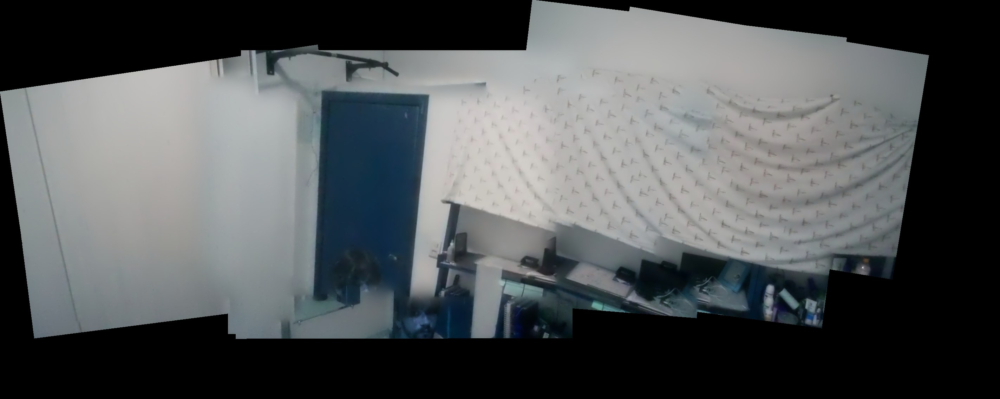

# Tello Drone — Inspeção Indoor com Mosaico

Pipeline de inspeção visual com um DJI Tello (~R$ 500): voo manual via ROS 2,
captura de frames, costura em mosaico e (em breve) detecção de defeitos.

**Stack:** DJI Tello · ROS 2 Humble · WSL2 (Windows 11) · Python/OpenCV · CPU-only

## Resultado atual — voo_11 (2026-07-07)

Mosaico costurado automaticamente a partir de uma varredura lateral de ~24 s
(frames capturados a cada 2 s de voo, stitching por feature matching):



## Como funciona

```
DJI Tello ──WiFi UDP──> driver tello (tentone) ──ROS 2──> /image_raw/compressed
                                                          /odom /imu /camera_info
                                                               │
                     teleop (teclado, keepalive 10 Hz) ────────┤
                     ros2 bag record ──> replay offline ───────┤
                                                               ▼
                                            mosaic_capture (1 frame / 2 s)
                                                               ▼
                                            stitch_mosaic.py ──> mosaico
```

- **Voo:** `scripts/tello_teleop.py` — teleop WASD com keepalive embutido
  (sem auto-land do SDK)
- **Gravação:** `ros2 bag record` → todo o desenvolvimento é feito **offline**,
  reproduzindo o bag, sem precisar ligar o drone
- **Captura:** nó `mosaic_capture` — salva frames + poses durante replay ou voo
- **Mosaico:** `scripts/stitch_mosaic.py` — OpenCV feature stitcher

## Estrutura

| Caminho | O quê |
|---|---|
| `PLAN.md` | plano do projeto, fases e checklist de testes |
| `DIARY.md` | diário de desenvolvimento (sessão a sessão, com root causes) |
| `scripts/` | teleop, stitcher, testes DDS, publisher fake |
| `tello_ws/src/tello` | driver tentone (patcheado: `/image_raw/compressed`, fixes) |
| `tello_ws/src/mosaic_capture` | nó de captura de frames |
| `data/bags/*/metadata.yaml` | metadados dos voos gravados (os `.db3` ficam fora do git) |

## Rodar (WSL2 + ROS 2 Humble)

```bash
# em CADA terminal:
source scripts/ros_env.sh

# Terminal 1 — driver (WiFi conectado ao Tello)
ros2 run tello tello

# Terminal 2 — vídeo ao vivo
ros2 run rqt_image_view rqt_image_view    # tópico: /image_raw/compressed

# Terminal 3 — gravar voo
ros2 bag record /image_raw/compressed /odom /imu /camera_info /status /battery -o data/bags/voo_XX

# Terminal 4 — voar
python3 scripts/tello_teleop.py           # t decola · wasd move · l pousa
```

Sem drone: `ros2 bag play data/bags/voo_11 --loop` substitui o Terminal 1.

## Status (2026-07-07)

- ✅ Voo controlado via ROS 2 (teleop + keepalive)
- ✅ Vídeo comprimido ponta a ponta (driver → bag → replay → captura)
- ✅ Primeiro mosaico real costurado de voo
- 🔲 Calibração da câmera (TEST 5)
- 🔲 Odometria visual (rtabmap, offline contra bag)
- 🔲 Detecção de defeitos (Fase 4 — aguardando definição do alvo de inspeção)

Histórico completo de decisões e root causes: [DIARY.md](DIARY.md)
